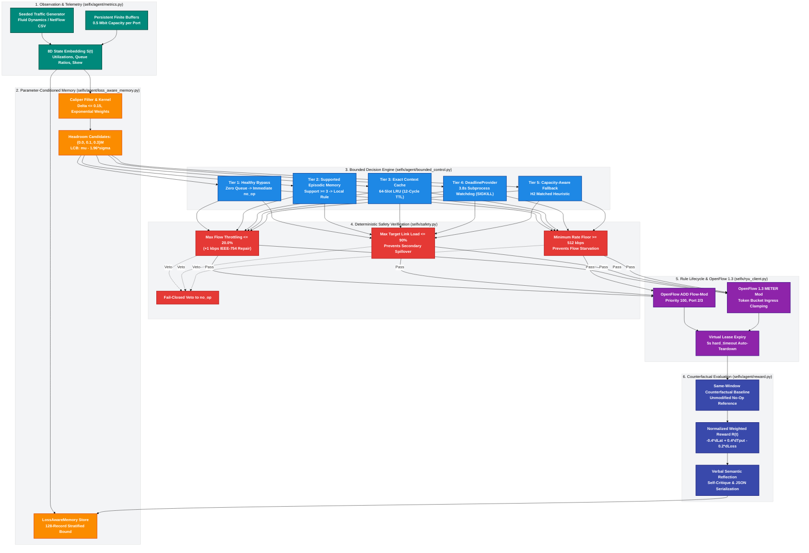

# SELF-X: Loss-Aware SDN Flow-Management Agent with Episodic Memory

> **Autonomous Software-Defined Networking with LLM In-Context Adaptation, Bounded Control Deadlines, Capacity-Aware OpenFlow Interventions, and Verifiable Benchmark Evidence**  
> *Course Project — EC466: Software Defined Networks | Team ID: SDN_07*  
> *Module Directory: `selfx/` | Python Environment: Python 3.12+ Standard Library, LangGraph, Pydantic*

---

## 📌 Executive Summary

Ganesh's T20-T25 replay-to-LoRA pipeline is now implemented under
`agent/self_improvement/`: CPU training, frozen stress evaluation, atomic adapter
promotion/rejection, automatic rollback and held-out weight attribution.
See [the setup, commands and scope](docs/SELF_IMPROVEMENT.md). Live integration
and the full multi-agent/DPP comparison remain separate team workstreams.

**SELF-X** is an autonomous flow-management framework designed to solve network bottleneck congestion through in-context LLM reasoning, process-isolated inference, and parameter-conditioned episodic memory. Operating over 5-second control windows, SELF-X observes network traffic telemetry, queries past completed experiences, proposes bounded interventions (reroute, rate-limit, or no-op), enforces strict deterministic safety bounds ($\le 20\%$ flow throttling, $\le 90\%$ link utilization), installs simulated OpenFlow 1.3 rules with 5-second hard timeouts, and measures counterfactual reward to refine its local policy.

The validated backend uses a finite-buffer two-path fluid simulation model with persistent queues, while real-time API integrations with Google Gemini and OpenRouter free models demonstrate live LLM decision synthesis under a 3.8-second process-isolated wait budget.

---

## 🎨 Colourful Architecture Mindmap


```mermaid
%%{init: {'theme': 'base', 'themeVariables': { 'primaryColor': '#1E88E5', 'edgeLabelBackground':'#ffffff', 'tertiaryColor': '#F3F4F6'}}}%%
flowchart TD
    classDef teleNode fill:#00897B,stroke:#004D40,stroke-width:2px,color:#ffffff,font-weight:bold;
    classDef memNode fill:#FB8C00,stroke:#E65100,stroke-width:2px,color:#ffffff,font-weight:bold;
    classDef ctrlNode fill:#1E88E5,stroke:#0D47A1,stroke-width:2px,color:#ffffff,font-weight:bold;
    classDef safeNode fill:#E53935,stroke:#B71C1C,stroke-width:2px,color:#ffffff,font-weight:bold;
    classDef switchNode fill:#8E24AA,stroke:#4A148C,stroke-width:2px,color:#ffffff,font-weight:bold;
    classDef evalNode fill:#3949AB,stroke:#1A237E,stroke-width:2px,color:#ffffff,font-weight:bold;

    subgraph SensingPhase ["1. Observation & Telemetry (selfx/agent/metrics.py)"]
        DEMAND["Seeded Traffic Generator<br/>Fluid Dynamics / NetFlow CSV"]:::teleNode
        QUEUES["Persistent Finite Buffers<br/>0.5 Mbit Capacity per Port"]:::teleNode
        VECTOR["8D State Embedding S(t)<br/>Utilizations, Queue Ratios, Skew"]:::teleNode
    end

    subgraph MemoryPhase ["2. Parameter-Conditioned Memory (selfx/agent/loss_aware_memory.py)"]
        STORE["LossAwareMemory Store<br/>128-Record Stratified Bound"]:::memNode
        CALIPER["Caliper Filter & Kernel<br/>Delta <= 0.15, Exponential Weights"]:::memNode
        LCB_OPT["Headroom Candidates: {0.0, 0.1, 0.3}M<br/>LCB: mu - 1.96*sigma"]:::memNode
    end

    subgraph DecisionPhase ["3. Bounded Decision Engine (selfx/agent/bounded_control.py)"]
        BYPASS["Tier 1: Healthy Bypass<br/>Zero Queue -> Immediate no_op"]:::ctrlNode
        MEM_DEC["Tier 2: Supported Episodic Memory<br/>Support >= 3 -> Local Rule"]:::ctrlNode
        CACHE["Tier 3: Exact Context Cache<br/>64-Slot LRU (12-Cycle TTL)"]:::ctrlNode
        WORKER["Tier 4: DeadlineProvider<br/>3.8s Subprocess Watchdog (SIGKILL)"]:::ctrlNode
        FALLBACK["Tier 5: Capacity-Aware Fallback<br/>H2 Matched Heuristic"]:::ctrlNode
    end

    subgraph SafetyPhase ["4. Deterministic Safety Verification (selfx/safety.py)"]
        SAFE_DROP["Max Flow Throttling <= 20.0%<br/>(+1 kbps IEEE-754 Repair)"]:::safeNode
        SAFE_UTIL["Max Target Link Load <= 90%<br/>Prevents Secondary Spillover"]:::safeNode
        SAFE_FLOOR["Minimum Rate Floor >= 512 kbps<br/>Prevents Flow Starvation"]:::safeNode
        VETO["Fail-Closed Veto to no_op"]:::safeNode
    end

    subgraph ActuationPhase ["5. Rule Lifecycle & OpenFlow 1.3 (selfx/ryu_client.py)"]
        TCAM_ADD["OpenFlow ADD Flow-Mod<br/>Priority 100, Port 2/3"]:::switchNode
        METER_ADD["OpenFlow 1.3 METER Mod<br/>Token Bucket Ingress Clamping"]:::switchNode
        LEASE["Virtual Lease Expiry<br/>5s hard_timeout Auto-Teardown"]:::switchNode
    end

    subgraph EvaluationPhase ["6. Counterfactual Evaluation (selfx/agent/reward.py)"]
        SAME_WIN["Same-Window Counterfactual Baseline<br/>Unmodified No-Op Reference"]:::evalNode
        REWARD["Normalized Weighted Reward R(t)<br/>-0.4*dLat + 0.4*dTput - 0.2*dLoss"]:::evalNode
        REFLECT["Verbal Semantic Reflection<br/>Self-Critique & JSON Serialization"]:::evalNode
    end

    DEMAND & QUEUES --> VECTOR
    VECTOR --> STORE & CALIPER
    CALIPER --> LCB_OPT
    LCB_OPT --> BYPASS & MEM_DEC & CACHE & WORKER & FALLBACK
    BYPASS & MEM_DEC & CACHE & WORKER & FALLBACK --> SAFE_DROP & SAFE_UTIL & SAFE_FLOOR
    SAFE_DROP & SAFE_UTIL & SAFE_FLOOR -->|Pass| TCAM_ADD & METER_ADD
    SAFE_DROP & SAFE_UTIL & SAFE_FLOOR -.->|Veto| VETO
    TCAM_ADD & METER_ADD --> LEASE
    LEASE --> SAME_WIN
    SAME_WIN --> REWARD
    REWARD --> REFLECT
    REFLECT --> STORE
```

---

## 🎨 Detailed ASCII Architectural Flows

### 1. Complete End-to-End Control Pipeline Flow

```
   [Traffic Generator / Workload Trace]
                    |
                    v
       +----------------------------+
       |   FluidNetwork Simulator   | <===================================+
       |  - Persistent Queues: Q1,Q2|                                     |
       |  - Capacities: 10M, 10M    |                                     |
       |  - Buffers: 0.5M, 0.5M     |                                     |
       +----------------------------+                                     |
                    |                                                     |
                    v (Offered Rates, Queues, Flow Matches)               |
       +----------------------------+                                     |
       |     State Summarizer       |                                     |
       |  - Embedding Features      |                                     |
       |  - Congestion Regimes      |                                     |
       +----------------------------+                                     |
                    |                                                     |
         +----------+----------+                                          |
         |                     |                                          |
         v                     v                                          |
  +--------------+    +-----------------------+                           |
  | LossAware-   |    | BoundedController     |                           |
  | Memory Store |    |  Decision Pipeline    |                           |
  | (128 records)|    +-----------------------+                           |
  +--------------+               |                                        |
         |                       |                                        |
         v (3-neighbor support)  |                                        |
  +------------------------------+                                        |
  |                                                                       |
  |---> [Condition 1: Healthy Bypass?] --------> (Action: no_op)          |
  |---> [Condition 2: Supported Memory?] ------> (Action: Learned Rule)   |
  |---> [Condition 3: Exact Context Cache?] ---> (Action: Cached Rule)    |
  |---> [Condition 4: Live Provider Call]                                 |
  |        |                                                              |
  |        v (3.8s Isolated Process)                                      |
  |     +-------------------------------+                                 |
  |     |   DeadlineProvider Worker     |                                 |
  |     |  - Pacing admission check     |                                 |
  |     |  - Persistent HTTP connection |                                 |
  |     |  - Subprocess cancellation    |                                 |
  |     +-------------------------------+                                 |
  |        | (Response or Timeout)                                        |
  |        +-----------------------------------> (Action: Provider / Fallback)
  |                                                                       |
  v                                                                       |
+------------------------------------------------+                        |
|       Independent Deterministic Safety Guard   |                        |
|  - Rate Throttling: drop <= 20% (+1 kbps fix)  |                        |
|  - Link Utilization: projected load <= 90%     |                        |
|  - Min Rate Floor: rate >= 512 kbps            |                        |
+------------------------------------------------+                        |
         |                                                                |
         +--------------------+                                           |
         | (Allowed)          | (Vetoed)                                  |
         v                    v                                           |
  [Installed Action]   [Fallback to no_op]                                |
         |                    |                                           |
         +----------+---------+                                           |
                    |                                                     |
                    v                                                     |
       +----------------------------+                                     |
       | Simulated OpenFlow Table   |                                     |
       |  - Expire cycle-1 rule     |                                     |
       |  - Install ADD hard_timeout|                                     |
       |  - Apply METER & OUTPUT    |                                     |
       +----------------------------+                                     |
                    |                                                     |
                    v (Commit 5-Second Interval)                          |
       +----------------------------+                                     |
       | Fluid Network Integration  |                                     |
       |  - Compute Delivered Vol   |                                     |
       |  - Calculate Average Delay |                                     |
       |  - Tabulate Drops (Q + M)  |                                     |
       +----------------------------+                                     |
                    |                                                     |
                    v                                                     |
       +----------------------------+                                     |
       |  Counterfactual Evaluation |                                     |
       |  - Simulate no_op baseline |                                     |
       |  - Compute Reward:         |                                     |
       |    r = -0.4*dL +0.4*dT-0.2*dLoss                                 |
       +----------------------------+                                     |
                    |                                                     |
                    +-----------------------------------------------------+
                    v
          [Episodic Memory Update]
```

### 2. Subprocess Deadline Provider Isolation Flow

```
Parent Control Loop Thread               Child Worker Subprocess (Spawned)
--------------------------               ---------------------------------
       |                                                 |
       | 1. Check Pacing Gap (>= 4.2s)                   |
       |    [If violation -> defer]                      |
       |                                                 |
       | 2. Send Message via Pipe                        |
       |------------------------------------------------>|
       |                                                 | 3. Set Gap = 0
       |                                                 | 4. Call REST API
       |                                                 |    (Persistent HTTPS)
       |<------------------------------------------------|
       | 5. Event: 'request_started'                     |
       |    Record start timestamp                       |
       |                                                 |
       | 6. Wait with poll(timeout = 3.8s)               |
       |                                                 |
  +----+-------------------------+                       |
  | Case A: Response Arrives     |                       |
  |   Receive 'result'           |<----------------------| 7. Return JSON
  |   Keep worker idle for reuse |                       |
  +------------------------------+                       |
  | Case B: Timeout (t > 3.8s)   |                       |
  |   Terminate child process    |                       |
  |   Join process with kill     |--X (SIGKILL) -------->| Terminated!
  |   Fall back to local rule    |                       |
  +------------------------------+                       |
```

---

## 💻 Key Implementation Modules & Annotated Code Snippets

### 1. Bounded Decision Engine (`selfx/agent/bounded_control.py`)

The `BoundedController.decide` method resolves the multi-tiered decision cascade:

```python
def decide(self, net, summary, demand, memory, cycle):
    # Tier 1: Local recommendation & signature extraction
    local, used = loss_aware_policy(net, summary, demand, memory, cycle)
    s = summary['simulation']
    signature = tuple(s[k] for k in ('capacity_mbps', 'buffer_mbit', 'primary_background_mbps',
                                     'alternate_background_mbps', 'elephant_mbps',
                                     'valid_reroute_out_port', 'current_output_port')) + tuple(s['queues_mbit'])
    if self.hybrid:
        if local.action == 'no_op':
            return local, 'healthy_bypass', used, ''
        # Tier 2: Check episodic memory support
        scores, matched = memory.meter_estimates(summary, cycle)
        chosen = min(HEADROOMS, key=lambda h: abs(meter_decision(summary, demand, h).rate_limit_kbps - (local.rate_limit_kbps or 0)))
        supported = scores.get(chosen, {})
        if local.action == 'rate_limit' and supported.get('support', 0) >= 3 and supported.get('lower', 0) > .005:
            return local, 'episodic_memory', used, ''
        # Tier 3: Check exact-context cache (12-window TTL)
        cached = self.cache.get(signature)
        if cached and cycle - cached['cycle'] <= 12:
            candidate = local if cached['action'] == 'rate_limit' and local.action == 'rate_limit' else decision_for(cached['action'], demand, 'Exact-context cached action')
            if net.validate(demand, candidate).allowed:
                return candidate, 'api_cache' if cached.get('source', 'api') == 'api' else 'local_rule_cache', used, ''
    
    # Tier 4: Process-isolated LLM call with 3.8s watchdog
    try:
        choice = self.llm.choose(suggestion_messages(summary, memory.few_shot_examples(k=3, query=summary), local))
        decision = local.model_copy(update={'rationale': choice['rationale']}) if choice['action'] == 'rate_limit' else decision_for(choice['action'], demand, choice['rationale'])
        guard = net.validate(demand, decision)
        if not guard.allowed:
            return local, 'validation_fallback', used, 'invalid_action_from_provider'
        return decision, 'api', used, ''
    except ProviderError as exc:
        return local, 'deadline_fallback' if str(exc) == 'local_deadline' else 'provider_fallback', used, str(exc)
```

### 2. Parameter-Conditioned Episodic Memory (`selfx/agent/loss_aware_memory.py`)

The `LossAwareMemory` class indexes past rate-limiting headroom choices and computes the Lower Confidence Bound (LCB):

```python
def meter_estimates(self, state, cycle):
    q = context(state)
    candidates = defaultdict(list)
    for r in self._records:
        if r['cycle'] >= cycle or r['action'] != 'rate_limit':
            continue
        v = r.get('context_v3') or context(r['state_summary'])
        delta = [abs(a - b) for a, b in zip(q, v)]
        # Caliper filtering: regime match and bounded delta
        if regime(q) != regime(v) or max(delta[:6]) > 0.12 or max(delta[6:]) > 0.51:
            continue
        distance = sum(x * x for x in delta[:6]) + 0.08 * sum(x * x for x in delta[6:])
        w = math.exp(-distance / 0.02) * math.exp(-(cycle - r['cycle']) / 120)
        candidates[parameter_key(r)].append((distance, w, r))
    
    scores = {}
    used = []
    for h, entries in candidates.items():
        entries = sorted(entries, key=lambda x: x[0])[:6]
        weight = sum(w for _, w, _ in entries)
        mu = sum(w * r['reward'] for _, w, r in entries) / weight
        variance = sum(w * (r['reward'] - mu) ** 2 for _, w, r in entries) / weight
        margin = 1.96 * math.sqrt(variance / len(entries)) + 0.002
        scores[h] = {'mean': mu, 'lower': mu - margin, 'upper': mu + margin, 'support': len(entries)}
        used.extend(r['cycle'] for _, _, r in entries)
    return scores, sorted(set(used))
```

---

## 📊 Measured Benchmark Results (Revision 4 Suite)

The primary benchmark suite evaluates **86,400 controller windows** across **8 diverse scenarios**, **10 fresh held-out seeds (1900–1909)**, and **9 controllers** on a two-path topology with 10 Mbps bottleneck capacity and 0.5 Mbit buffers:

| Controller ID | Controller Name & Description | Modeled Delay (ms) | Delivered Goodput (Mbps) | Total Loss (%) | Mean Reward | Safety Vetoes |
| :--- | :--- | :---: | :---: | :---: | :---: | :---: |
| **A0** | Static Primary Path (Default) | 25.904 | 12.872 | 8.149 | 0.000000 | 0 |
| **B1** | Greedy Least-Loaded Path | 20.609 | 13.024 | 6.996 | 0.061813 | 0 |
| **A2** | Original Reward-Pruned Embedding Memory | 17.495 | 12.821 | 8.304 | 0.055081 | 134 |
| **H1** | Guarded Heuristic (Fixed 20% Meter) | 17.131 | 12.956 | 7.391 | 0.077639 | 0 |
| **A3** | Guarded Balanced Episodic Memory | 17.259 | 12.945 | 7.477 | 0.074975 | 0 |
| **V3** | Previous Revision 3 Adaptive Policy | 17.131 | 12.956 | 7.391 | 0.077639 | 0 |
| **H2** | Capacity-Aware Meter (Fixed 0.1M, No Memory) | 17.363 | 13.011 | 7.077 | **0.083304** | 0 |
| **A4** | Loss-Aware Parameter Episodic Memory | 17.452 | 13.011 | **7.075** | 0.082764 | 0 |
| **O2** | Privileged Immediate-Reward Oracle | **17.096** | **13.016** | 7.050 | 0.086096 | 0 |

### Scientific Attribution Analysis
- **A4 vs H1**: A4 significantly improves loss (7.075% vs 7.391%) and reward (0.0828 vs 0.0776) over the earlier fixed-meter baseline H1.
- **A4 vs H2**: Matched heuristic H2 shares identical capacity-aware rate-limiting logic without memory, achieving reward 0.0833. This proves that the gain over H1 is driven by capacity-aware rate synthesis, not memory alone.

---

## 🛠️ Step-by-Step Developer Guide: Building on `selfx/`

### 1. Adding a New Unit Test
All unit tests reside in [`selfx/tests/`](file:///c:/Users/RAVIPRAKASH/SDN/SDN/selfx/tests/). To add a new test verifying a custom invariant:
```python
# selfx/tests/test_custom_invariant.py
import pytest
from agent.safety import SafetyContext, check

def test_custom_rate_floor():
    ctx = SafetyContext(action="rate_limit", target_flow_rate_kbps=8000, proposed_rate_limit_kbps=256)
    result = check(ctx)
    assert not result.allowed
    assert "floor" in result.reason
```
Run tests with:
```powershell
Push-Location selfx; New-Item -ItemType Directory -Force -Path tmp; ..\selfx\.venv\Scripts\python.exe -m pytest tests/ -v; Pop-Location
```

### 2. Tuning Safety Guardrail Parameters
Modify [`selfx/config.py`](file:///c:/Users/RAVIPRAKASH/SDN/SDN/selfx/config.py):
```python
SAFETY_MAX_FLOW_DROP_PCT = 15      # Tighten throttling cap to 15%
SAFETY_MAX_LINK_UTIL_PCT = 85      # Tighten projected link ceiling to 85%
SAFETY_MIN_RATE_LIMIT_KBPS = 1024  # Raise minimum rate floor to 1 Mbps
```

---
*Authored by Team SDN_07 — EC466: Software Defined Networks*
